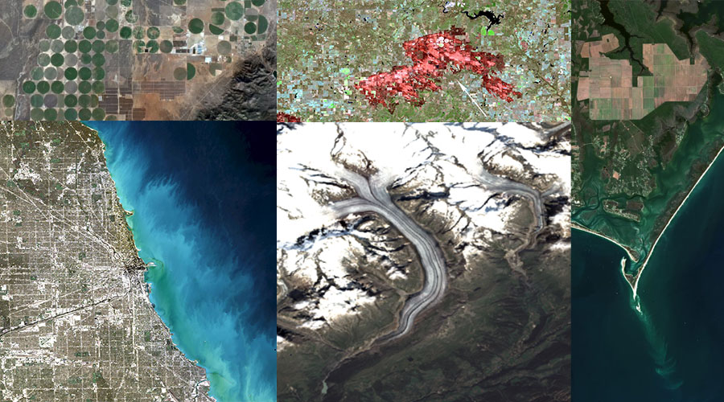

## Welcome

Welcome to the **2022 LP DAAC UWG Breakout Session** hosted by NASA’s Land Processes Distributed Activate Archive ([LP DAAC]( https://lpdaac.usgs.gov/)) with support from [NASA Openscapes](https://nasa-openscapes.github.io/).

**The workshop will take place in-person (!) on May 26, 2022 from 8:30am - 12:00pm CDT [(UTC-5)](https://www.timeanddate.com/time/zones/cdt)**.

## Agenda

### May 26th, 2022

| Time, CDT [(UTC-5)](https://www.timeanddate.com/time/zones/cdt) | Event | Leads/Instructors | Reference/Resource |
|------|-------|-------|-------|
| 8:45 am | Welcome / Workshop Expectations | Aaron Friesz & Danielle Golon | |
| 8:50 am | LP DAAC Website Tour | Danielle Golon | |
| 9:20 am | AppEEARS Demo | Danielle Golon | |
| 9:50 am | Earthdata Search Demo | Danielle Golon | |
| 10:15 am | Break/QA | | |
| 10:30 am | Earthdata Cloud - Bulk Download | Aaron Friesz | |
| 10:45 am | Openscapes 2i2c workspace ([Launch](https://openscapes.2i2c.cloud/hub/user-redirect/git-pull?repo=https%3A%2F%2Fgithub.com%2FNASA-Openscapes%2F2021-Cloud-Hackathon.git&urlpath=lab%2Ftree%2F2021-Cloud-Hackathon.git%2F&branch=main)) | Aaron Friesz | [2021 Cloud Hackathon](https://nasa-openscapes.github.io/2021-Cloud-Hackathon/) |
| 10:55 am | Earthdata Cloud - CMR API ([Launch](https://openscapes.2i2c.cloud/hub/user-redirect/git-pull?repo=https%3A%2F%2Fgithub.com%2FNASA-Openscapes%2F2021-Cloud-Hackathon.git&urlpath=lab%2Ftree%2F2021-Cloud-Hackathon.git%2F&branch=main)) | Aaron Friesz | [2021 Cloud Hackathon](https://nasa-openscapes.github.io/2021-Cloud-Hackathon/) |
| 11:20 am | Earthdata Cloud - CMR STAC API ([Launch](https://openscapes.2i2c.cloud/hub/user-redirect/git-pull?repo=https%3A%2F%2Fgithub.com%2FNASA-Openscapes%2F2021-Cloud-Hackathon.git&urlpath=lab%2Ftree%2F2021-Cloud-Hackathon.git%2F&branch=main)) | Aaron Friesz | [2021 Cloud Hackathon](https://nasa-openscapes.github.io/2021-Cloud-Hackathon/) |
| 11:50 am | Break/QA | |
| 12:05 pm | Intro to xarray ([Launch](https://openscapes.2i2c.cloud/hub/user-redirect/git-pull?repo=https%3A%2F%2Fgithub.com%2FNASA-Openscapes%2F2021-Cloud-Hackathon.git&urlpath=lab%2Ftree%2F2021-Cloud-Hackathon.git%2F&branch=main)) | Aaron Friesz | [2021 Cloud Hackathon](https://nasa-openscapes.github.io/2021-Cloud-Hackathon/) |
| 12:20 am | Earthdata Cloud - COG Data Access ([Launch](https://openscapes.2i2c.cloud/hub/user-redirect/git-pull?repo=https%3A%2F%2Fgithub.com%2FNASA-Openscapes%2F2021-Cloud-Workshop-AGU.git&urlpath=lab%2Ftree%2F2021-Cloud-Workshop-AGU.git%2F&branch=main)) | Aaron Friesz | [2021 Earthdata Cloud Workshop at AGU](https://nasa-openscapes.github.io/2021-Cloud-Workshop-AGU/) |
| 12:35 am | Earthdata Cloud - NetCDF Data Access with Kerchunk ([Launch](https://openscapes.2i2c.cloud/hub/user-redirect/git-pull?repo=https%3A%2F%2Fgithub.com%2FNASA-Openscapes%2Fearthdata-cloud-cookbook.git&urlpath=lab%2Ftree%2Fearthdata-cloud-cookbook.git%2F&branch=main)) | Aaron Friesz | [Earthdata Cloud Cookbook](https://nasa-openscapes.github.io/earthdata-cloud-cookbook/) |
| 12:45 pm | Break/QA/Lunch | |

## Additional Resources

- [Intro to NASA Cloud Data Access](https://git.earthdata.nasa.gov/projects/LPDUR/repos/lpdaac_cloud_data_access/browse)
- [2022 ECOSTRESS Workshop](https://nasa-openscapes.github.io/2022-ECOSTRESS-Cloud-Workshop/)

## Acknowledgements

2022 LP DAAC UWG breakout session is hosted by NASA's LP DAAC with support from the NASA Openscapes Project, with cloud computing infrastructure by 2i2c. 
